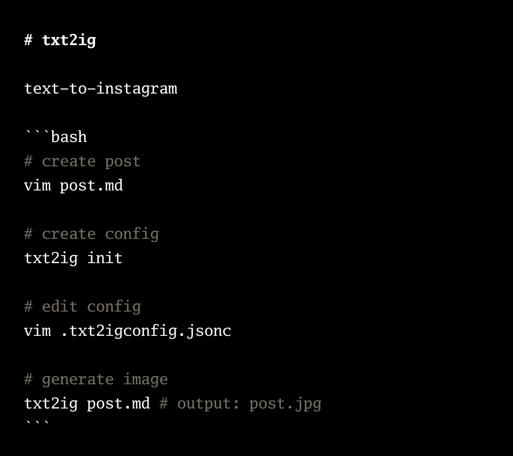

# txt2ig



text-to-instagram

a cli tool to generate images with plain text

terminal content creation for instagram

simple workflow, simple config

> not to be confused with `txt2img` for ai image gen

## installation

### go install (recommended)

```bash
go install github.com/gjtiquia/txt2ig@latest
```

<details>
<summary>other useful commands:</summary>

```bash
# checks what is the latest available version on go proxy cache
go list -m github.com/gjtiquia/txt2ig@latest

# checks what is the latest version directly from GitHub
GOPROXY=direct go list -m github.com/gjtiquia/txt2ig@latest

# installs latest version directly from GitHub
GOPROXY=direct go install github.com/gjtiquia/txt2ig@latest

# installs binary at current directory instead of a global install
GOBIN=$(pwd) go install github.com/gjtiquia/txt2ig@latest
```
</details>

## usage

### cli

```bash
# generate image with default config
# (see config section below on customizing config)
txt2ig post.md # output: post.jpg

# set output file name and extension (.jpg and .png only)
txt2ig post.md -o another-name.png

# watch mode: regenerate image on file save
txt2ig post.md -w

# watch mode with web live preview at port 3000
txt2ig post.md -w -p 3000

# see help for more
txt2ig -h
```

### web app

for creating plain text images on the browser

```bash
# serve web app at port 3000
txt2ig web -p 3000
```

## config

config is a simple jsonc (JSON with Comments) file

### quick start

```bash
# generate config file in current directory
txt2ig init

# edit config file
vim .txt2igconfig.jsonc

# use custom config file
txt2ig post.md
```

see [`/example/`](./example/)

### config location

txt2ig will look for config file in the following order
- custom config (`-c`/`--config`)
- local: `./.txt2igconfig.jsonc`
- global: `XDGCONFIG/txt2ig/config.jsonc`
- global: `~/.txt2ig/config.jsonc`
- use defaults

run the following command to check which config is currently in-use
```bash
txt2ig --debug
```

### config params

the following are the default config params,
feel free to copy and paste this to your own config and override what you need

```jsonc
{
    // font family configuration with bold/italic variants
    // supports font names and file paths with fallback chain
    // embedded GoMono variants available: GoMono, GoMonoBold, GoMonoItalic, GoMonoBoldItalic
    "fontFamily": {
        "regular": ["GoMono"],
        "bold": ["GoMonoBold"],
        "italic": ["GoMonoItalic"],
        "boldItalic": ["GoMonoBoldItalic"]
    },
    // unit: px
    "fontSize": 32,
    "fontColor": "#FFFFFF",
    "bgColor": "#000000",
    // text x-axis position within the text box
    "textJustify": "left", // "center", "right"
    // text box (bounding box of text) x-axis position on screen
    "textBoxJustify": "center", // "left", "right"
    // text box (bounding box of text) y-axis position on screen
    "textBoxAlign": "center", // "top", "bottom"
    // text box (bounding box of text) (x, y) offset. unit: px
    "textBoxOffset": [0, 0],
    // maximum width for text box. unit: px. 0 = auto (90% of screen width)
    "textBoxMaxWidth": 972,
    // screen/canvas size. [width, height]. unit: px
    "screenSize": [1080, 1920],
    // enable automatic text wrapping
    "textWrap": true,
    // line height multiplier (1.4 = 1.4x font size)
    "lineHeight": 1.4,

    // processors will run in sequence,
    // you may chain several processors of the same name to get different results if you so desire

    // typically pre-process text
    "preProcessors": [
        // {
        //     "exactSearchAndReplace": {
        //         "searchString": "apple", // exact match only
        //         "replaceString": "bananas",
        //     }
        // }

        // {
        //     "grepSearchAndReplace": {
        //         "pattern": "^@foo",
        //         "replaceString": "bar",
        //     }
        // }

        // {
        //     "exactSearchAndReplaceWithDateTimeNow": {
        //         "searchString": "@date",
        //         "replaceFormat": "yyyy-mm-dd", // supports yyyy, mm, dd, hh, mm, ss
        //     }
        // }
    ],

    // typically post-process styling
    "postProcessors": [
        {
            // lines starting with # will be bold
            "markdown-bold-headers": {
                "bold": true,
                // set to empty to use the same default color
                // "fontColor": "#EC9006" // orange
            }
        },

        // {
        //      // lines starting with # will be italic and different color
        //     "bash-comments": {
        //         "italic": true,
        //         "fontColor": "#CCCCCC" // gray
        //     }
        // }

        {
            // highlights bash code blocks with Chroma syntax highlighting
            "bash-code-highlighting": {
                "style": "monokai", // Chroma style (monokai, dracula, github, etc.)
                "defaultColor": "#FFFFFF" // fallback color when Chroma doesn't provide one
            }
        },
    ],
}
```

## development

```bash
# generate templ components
templ generate

# run tests
go test ./...

# run cli
go run .

# build cli
go build .
```

## future roadmap

### plugin system

a way to build 3rd party plugins in addition to the official plugins available
- pre-processors
- post-processors

perhaps look into go plugins...? see how gonotify does it

## ai-usage disclosure

ai is heavily used for generating code in this project

continuing the ai workflow exploration after [ifg](https://github.com/gjtiquia/ifg)

some thoughts
- golang is still a really great language to vibecode with!
- Opencode Go GLM 5 is apparently pretty good at doing long running tasks and thorough research!
- a really great workflow i find to work well so far is
  - create a solid README.md first, as if the tool already exists
  - this helps you scope out the project and hv a vision for the final product first
  - also provides an anchor for the LLM to develop on (kinda like GDD for game devs)

(inspired by [ghostty's ai usage policy](https://github.com/ghostty-org/ghostty/blob/main/AI_POLICY.md))

## license

MIT
